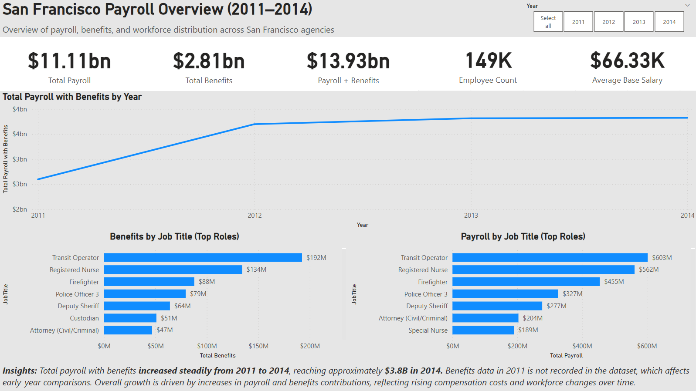

# **San Francisco Payroll Analysis (2011-2014)**
**Power BI | Payroll Trends, Simulation & Forecasting**

---

## **Project Overview**
Analyzed the **San Francisco Payroll** dataset to uncover:
- yearly cost for payroll and benefits for the whole jobtitle
- analysis of which jobtitle is high cost and low cost
- simulation of variance amount of increment of cost for each years
- forecasting & trend analysis for the next two years
  
---

## **Business Problem**
Identify and analysis of budget allocations between different groups

---

## **Dataset**
- Source: https://www.kaggle.com/datasets/kaggle/sf-salaries
- Time period: 2011-2014
- Key fields: Business, Jobs, and Income

---

## **Tools Used**
- Power BI: Cleaning, interactive dashboard, advanced visuals, analysis and forecasting
  
---

## **Dashboard Pages**

1. Executive Overview - KPI, and charts for both total payroll and benefits by jobtitles
2. Root Cause Analysis - Decompision tree and key influencers analysis to identify 
3. Interactive Exploration - Payroll comparison between agency, jobtitle and year
4. Scenario Simulation - Simulate variance amount for possibiliies of increment budgetting
5. Forecast & Trend Analysis - Forecase and trend analysis for up coming two years
   
---

## **Key Insights**
- Total payroll with benefits **increased steadily from 2011 to 2014**, reaching approximately **$3.8B in 2014** but **benefits in 2011 is not recorded** in the dataset, which affects early-year comparions
- Highly **concentrated payroll** structure driven by a small number of key occupations for both top 10 job titles and lower-ranked roles
- When simulate, a **10% increase in overtime leads to approximately ~$75.31M additional payroll**, representing a **0.5% increase which highly influenced by high cost roles**
- Payroll is projected to continue **rising over the next two years**, reaching approximately **~$4.28B in 2015 and ~$4.65B in 2016**

---

## **Business Impact**
- Investigate are there any wastage in budget allocations for job title
- find a way to reduce budget allocations increment towards upcoming years
-

---

## **Dashboard Preview**

Click on the Power BI file in the `powerbi/` folder to explore the interactive dashboard.
