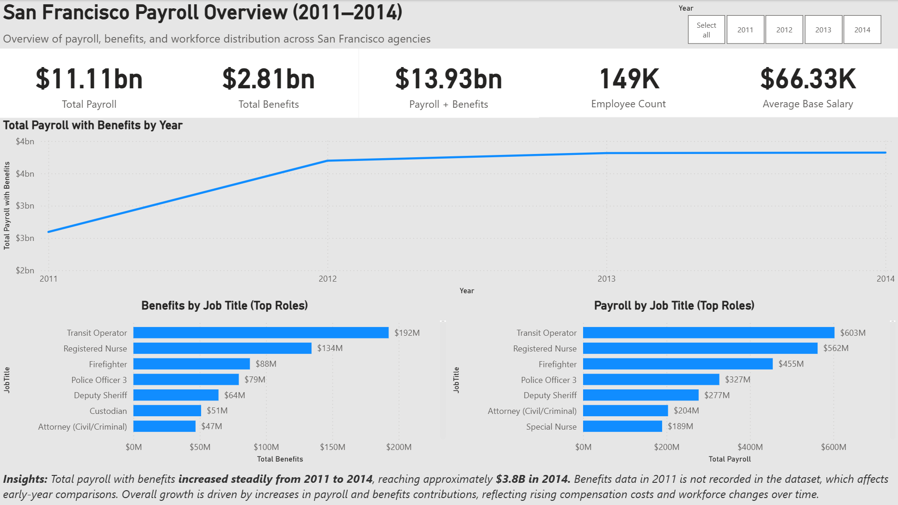
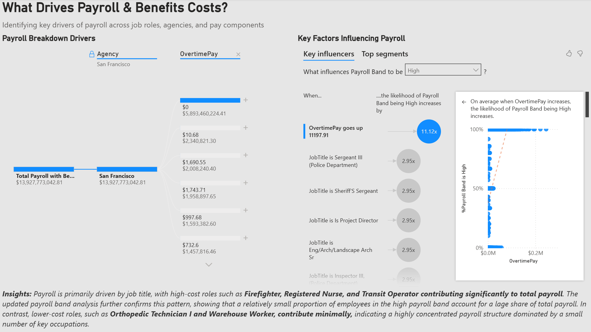
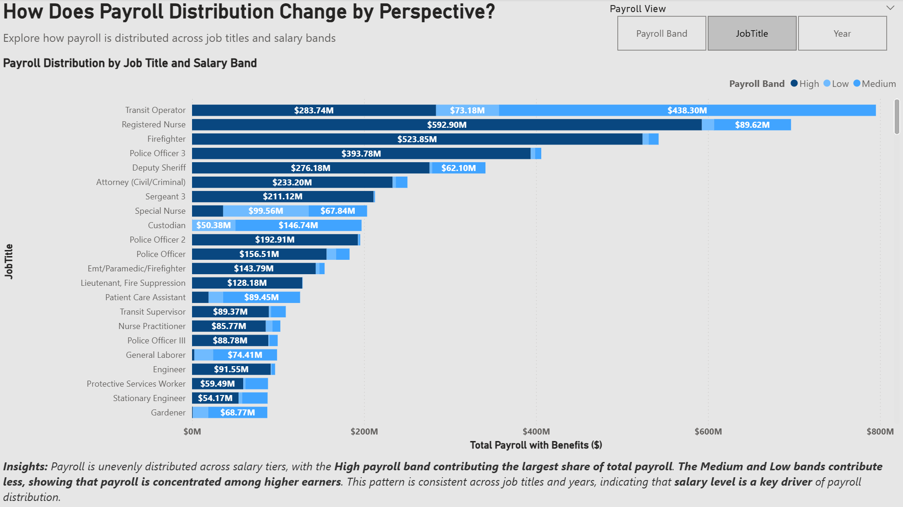
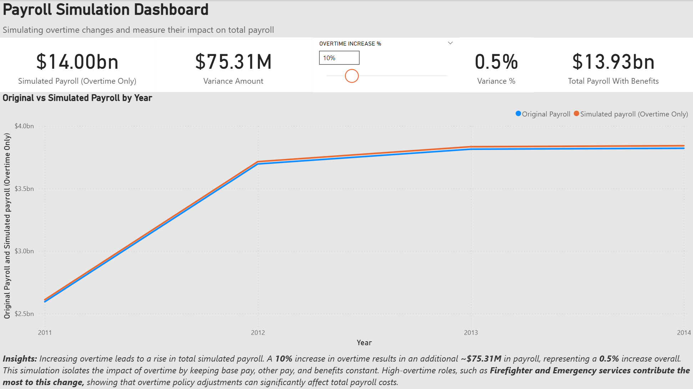
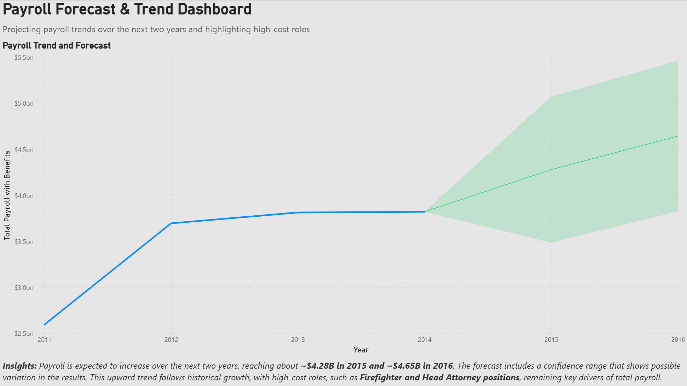

# **San Francisco Payroll Analysis (2011-2014)**
**Power BI | Payroll Trends, Simulation & Forecasting**

---

## **Project Overview**
Analyzed the **San Francisco Payroll (2011-2014) dataset** to understand workforce compensation trends and cost drivers.

This project explores payroll and benefits distribution across job titles, identifies high-cost roles, and evaluates how changes in overtime impact total payroll. It also includes forecasting to project future payroll trends.

---

## **Business Problem**
Organizations need to understand how payroll costs are distributed across roles and how policy changes (e.g., overtime adjustments) impact total expenditure.

This analysis aims to identify key cost drivers and support better workforce and budget planning decisions.

---

## **Dataset**
- Source: https://www.kaggle.com/datasets/kaggle/sf-salaries
- Time period: 2011-2014
- Key fields: Job Title, Base Pay, Overtime Pay, Other Pay, Benefits, Total Pay, Total Pay + Benefits

---

## **Tools Used**
- Power BI: Data cleaning (Power Query), DAX measures, interactive dashboard, What-If parameter (scenario simulation), forecasting
  
---

## **Methodology**
- Data cleaning performed in Power Query
- DAX measures used for payroll aggregation and simulation
- Percentile-based segmentation for payroll bands
- What-if parameter used for scenario simulation
- Built-in Power BI forecasting for trend analysis

---

## **Dashboard Pages**

1. **Executive Overview** - High-level KPIs and trends for total payroll and benefits by job titles across years
2. **Root Cause Analysis** - Decomposition Tree and Key Influencers to identify key cost-driving roles 
3. **Interactive Exploration** - Dynamic comparison across payroll bands, job titles, and years
4. **Scenario Simulation** - What-if analysis to evaluate the impact of overtime changes on payroll
5. **Forecast & Trend Analysis** - Forecasting payroll trends for the next two years

---

## **Key Insights**
- Total payroll with benefits **increased steadily from 2011 to 2014**, reaching approximately **$3.8B in 2014**
- **Benefits data is not available for 2011**, which impacts early-year comparisons
- Payroll is **highly concentrated**, with a small number of job titles contributing significantly to total cost
- A **10% increase in overtime results in ~$75.31M additional payroll (~0.5%)**, driven mainly by high-overtime roles
- Payroll is projected to continue **rising**, reaching approximately **$4.28B in 2015 and $4.65B in 2016**

---

## **Business Impact**
- Identify **high-cost roles** driving payroll expenditure
- Supports **budgeting decisions** around overtime policies
- Helps evaluate **workforce cost efficiency**
- Enables forecasting of **future payroll risks**

---

## **Dashboard Preview**

### Executive Overview

### Root Cause Analysis

### Interactive Exploration

### Scenario Simulation

### Forecast & Trend Analysis

Click on the Power BI file in the `powerbi/` folder to explore the interactive dashboard.
